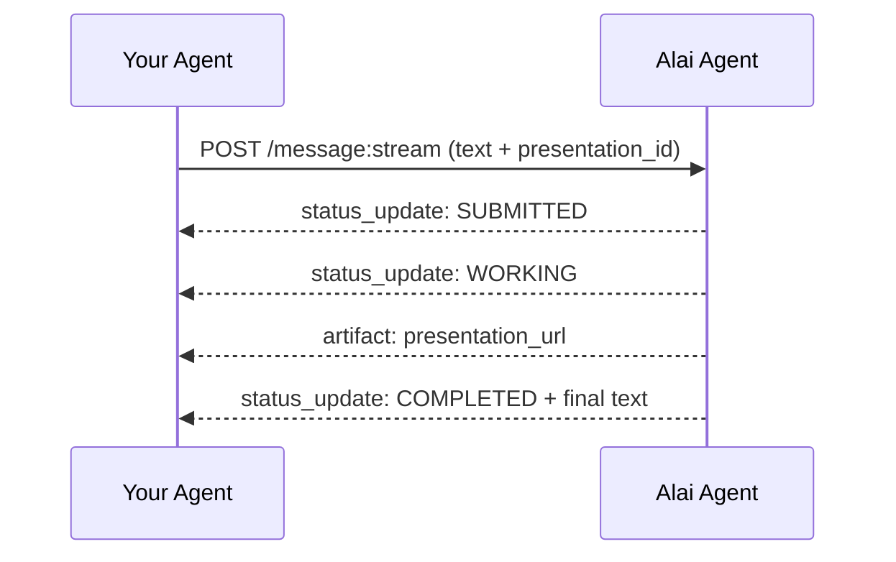

The **Alai A2A Agent** lets external agents drive Alai presentations through the [Agent2Agent (A2A) protocol](https://a2a-protocol.org/) — an open standard (originally from Google, now stewarded by the [a2aproject](https://github.com/a2aproject)) that lets one agent call another over HTTP+JSON with first-class support for long-running tasks, streaming, and human-in-the-loop pauses.

Use A2A when your own agent (or product) needs to _delegate_ presentation editing work to the Alai Agent and get back a structured task lifecycle, not just a one-shot REST response.

**A2A URL:** `https://alai-standalone-backend.getalai.com/a2a`

<Note>
  The A2A endpoint is in **beta**. The Alai Agent currently exposes a single
  skill — `manage_presentation` — that edits an **existing** presentation. To
  create a presentation from scratch, use the [REST `/generations`
  endpoint](/api/generations) or [MCP](/api/mcp), then hand the
  `presentation_id` to the Alai Agent for follow-up edits.
</Note>

---

## When to use A2A vs MCP vs REST

<CardGroup cols={3}>
  <Card title="A2A" icon="network-wired">
    Your **autonomous agent** needs to delegate work to the Alai Agent and
    handle a task lifecycle (streaming updates, mid-task questions, retries).
    Standardised protocol, agent-to-agent.
  </Card>
  <Card title="MCP" icon="robot" href="/api/mcp">
    A **human-driven AI editor** (Claude, Cursor, VS Code, ChatGPT) needs Alai
    tools wired into its tool palette via OAuth.
  </Card>
  <Card title="REST" icon="code" href="/api/introduction">
    A **traditional backend or script** needs straight HTTP request/response
    with API key auth.
  </Card>
</CardGroup>

---

## Authentication

A2A uses the same API keys as the REST API (`sk_…`). Pass them as a Bearer token:

```bash
Authorization: Bearer YOUR_API_KEY
```

If you don't have a key yet, see [Get Your API Key](/api/introduction#get-your-api-key).

The `api-key` header is also accepted as a fallback for clients that can't set `Authorization`.

<Warning>
  All A2A requests must be authenticated. Unauthenticated requests return `401
  Unauthorized` — the only exception is the public agent card discovery path
  under `/.well-known/`.
</Warning>

---

## Agent Card Discovery

Every A2A server publishes an **Agent Card** describing its identity, capabilities, supported protocols, skills, and security requirements. Standard-compliant A2A clients fetch this card first and then route requests according to its contents.

```bash
curl https://alai-standalone-backend.getalai.com/a2a/.well-known/agent-card.json
```

Example response (abridged):

```json
{
  "name": "Alai Agent",
  "description": "Edits existing Alai presentations.",
  "version": "1.0.0",
  "supported_interfaces": [
    {
      "protocol_binding": "HTTP+JSON",
      "protocol_version": "1.0",
      "url": "https://alai-standalone-backend.getalai.com/a2a"
    }
  ],
  "default_input_modes": ["text/plain", "application/json"],
  "default_output_modes": ["text/plain", "application/json"],
  "capabilities": { "streaming": true, "push_notifications": false },
  "skills": [
    {
      "id": "manage_presentation",
      "name": "Manage Presentation",
      "description": "Edit presentations -- modify slide content, layout, themes and structure. Include `presentation_id` (required) in a DataPart.",
      "tags": ["alai", "presentation", "slides", "editing"]
    }
  ],
  "security_schemes": {
    "Bearer": {
      "http_auth_security_scheme": {
        "scheme": "bearer",
        "description": "Alai API key (sk_...)."
      }
    }
  }
}
```

<Tip>
  If you're using the official [`a2a-sdk`](https://pypi.org/project/a2a-sdk/),
  use `A2ACardResolver(httpx_client, base_url).get_agent_card()` instead of
  fetching the JSON yourself — the resolver handles content negotiation, version
  checks, and constructs an `AgentCard` proto for you.
</Tip>

---

## Quickstart

A single streaming edit request looks like this on the wire. For Python, TypeScript, or other languages, use the official [`a2a-sdk`](https://pypi.org/project/a2a-sdk/), which wraps these endpoints in idiomatic clients.

```bash
curl -X POST "https://alai-standalone-backend.getalai.com/a2a/message:stream" \
  -H "Authorization: Bearer YOUR_API_KEY" \
  -H "Content-Type: application/json" \
  -H "A2A-Version: 1.0" \
  -d '{
    "message": {
      "role": "ROLE_USER",
      "message_id": "11111111-1111-1111-1111-111111111111",
      "context_id": "22222222-2222-2222-2222-222222222222",
      "parts": [
        { "text": "Make the title on slide 3 bigger." },
        { "data": { "presentation_id": "PRESENTATION_UUID" } }
      ]
    }
  }'
```

<Note>
  Reuse the same `context_id` across turns to keep the Alai Agent in the same
  conversation (so it has memory of earlier edits). Generate a new one when
  starting a fresh session.
</Note>

---

## The `manage_presentation` Skill

The Alai Agent currently exposes one skill that handles edits to an existing presentation.

### Required input

| Part                   | Type     | Required | Description                                                                         |
| ---------------------- | -------- | -------- | ----------------------------------------------------------------------------------- |
| `text`                 | TextPart | yes      | Natural-language instruction (e.g. _"Change the chart on slide 4 to a bar chart"_). |
| `data.presentation_id` | DataPart | yes      | UUID of an existing Alai presentation the API key has access to.                    |

A request without `presentation_id`, or one referencing a presentation the API key cannot access, returns `400 Bad Request`.

### What the agent can do

- Modify slide content, layout, themes, and structure on existing presentations
- Export the presentation to PDF or PPTX (delivered as artifacts — see below)
- Ask clarifying questions when an edit is ambiguous (see [Handling INPUT_REQUIRED](#handling-input-required))

### What the agent will not do

- Create a new presentation from scratch (use [`POST /generations`](/api/generations) instead)
- Return download or share URLs inside its text reply — those are always delivered as separate **Artifacts**

### Example prompts

```
Make the title on slide 3 bigger.
Change the theme to dark blue.
Add a chart on slide 2 showing monthly growth.
Export this presentation as a PDF.
Replace the bullet points on slide 5 with a 2x2 grid.
```

---

## Task Lifecycle

Every request creates a **Task**. A2A clients stream task state transitions and any artifacts emitted along the way.

| State                       | Meaning                                                                                                                      |
| --------------------------- | ---------------------------------------------------------------------------------------------------------------------------- |
| `TASK_STATE_SUBMITTED`      | Request accepted, queued for execution.                                                                                      |
| `TASK_STATE_WORKING`        | The Alai Agent is processing the request. The `presentation_url` artifact is emitted on entry.                               |
| `TASK_STATE_INPUT_REQUIRED` | The Alai Agent needs a clarifying answer before it can continue. The task is paused — see [below](#handling-input-required). |
| `TASK_STATE_COMPLETED`      | Edits applied successfully; the final reply text is in the terminal status message.                                          |
| `TASK_STATE_FAILED`         | The request could not be completed. The status message contains a brief reason.                                              |
| `TASK_STATE_CANCELED`       | The task was cancelled via `POST /tasks/{id}:cancel`.                                                                        |

A typical happy-path sequence:



---

## Handling `INPUT_REQUIRED`

When the Alai Agent needs more information to fulfill a request (e.g. you said _"change the chart"_ but didn't say to what), the task transitions to `TASK_STATE_INPUT_REQUIRED`. The status message contains the question(s) for you or your upstream user to answer.

To resume, send a new message **with the same `context_id` and the same `task_id`**. The agent will treat your reply as the answer to the pending question and continue from where it left off.

```python
# After receiving INPUT_REQUIRED on `task_id`, send the answer:
reply = Message(
    role=Role.ROLE_USER,
    message_id=str(uuid.uuid4()),
    parts=[
        Part(text="Use a bar chart with monthly data."),
        Part(data=ParseDict({"presentation_id": PRESENTATION_ID}, Value())),
    ],
    context_id=context_id,   # SAME context as original turn
    task_id=current_task_id, # SAME task to resume it
)
async for event in client.send_message(SendMessageRequest(message=reply)):
    ...
```

<Tip>
  Any partial edits made before the question was raised are preserved, so
  resuming doesn't undo prior work.
</Tip>

---

## Artifacts

Artifacts are first-class outputs the agent attaches to a task. The Alai Agent emits up to three:

| Artifact name      | Emitted when                                                                          | Part shape                                                                                                               |
| ------------------ | ------------------------------------------------------------------------------------- | ------------------------------------------------------------------------------------------------------------------------ |
| `presentation_url` | Always — emitted as soon as the task enters `WORKING`. Contains the live editor link. | `url` part with `media_type: text/html`                                                                                  |
| `pdf_export`       | You ask for a PDF export and it finishes successfully.                                | `url` part with `media_type: application/pdf` and a `filename`                                                           |
| `ppt_export`       | You ask for a PowerPoint export and it finishes successfully.                         | `url` part with `media_type: application/vnd.openxmlformats-officedocument.presentationml.presentation` and a `filename` |

Example artifact event:

```json
{
  "artifact_update": {
    "artifact": {
      "name": "pdf_export",
      "parts": [
        {
          "url": "https://signed-export-url...",
          "media_type": "application/pdf",
          "filename": "presentation.pdf"
        }
      ]
    }
  }
}
```

<Note>
  Exports are generated asynchronously and may take up to a few minutes for
  large presentations. If an export does not complete within that window, the
  task still finishes and the agent's reply will explain that the export is
  still in progress.
</Note>

---

## HTTP Endpoints

Alai's A2A server exposes the standard set of REST endpoints defined by the protocol. Most integrations should use the official [`a2a-sdk`](https://pypi.org/project/a2a-sdk/) rather than calling these directly, but they're listed here for reference and `curl`-based testing.

| Method | Path                           | Purpose                                                                             |
| ------ | ------------------------------ | ----------------------------------------------------------------------------------- |
| `GET`  | `/.well-known/agent-card.json` | Fetch the public agent card (no auth required).                                     |
| `POST` | `/message:send`                | Send a message and wait for the final task.                                         |
| `POST` | `/message:stream`              | Send a message and stream task events as they happen (recommended).                 |
| `GET`  | `/tasks/{id}`                  | Fetch the current state of a task.                                                  |
| `POST` | `/tasks/{id}:cancel`           | Cancel an in-flight task.                                                           |
| `POST` | `/tasks/{id}:subscribe`        | Re-attach to an in-flight task's event stream after disconnect.                     |
| `GET`  | `/tasks`                       | List recent tasks (filterable by `context_id`, `status`, `status_timestamp_after`). |

All endpoints except agent-card discovery require `Authorization: Bearer YOUR_API_KEY`. The wire format follows the [A2A protocol v1.0 specification](https://a2a-protocol.org/v1.0.0/specification/).

---

## Error Responses

| Code  | Reason                                                                                                 |
| ----- | ------------------------------------------------------------------------------------------------------ |
| `400` | Invalid request — typically a missing `presentation_id` or a `presentation_id` your key cannot access. |
| `401` | Missing or invalid bearer token.                                                                       |
| `500` | An unexpected error occurred.                                                                          |

Failures that happen _after_ a task has started surface as `TASK_STATE_FAILED` on the task itself, not as HTTP errors — by that point the request has already been accepted, so the failure lives in the task lifecycle.

---

## Next Steps

<CardGroup cols={2}>
  <Card
    title="Generate a presentation first"
    icon="sparkles"
    href="/api/generations"
  >
    A2A only edits existing presentations — start with the REST `/generations`
    endpoint or MCP.
  </Card>
  <Card title="MCP Integration" icon="robot" href="/api/mcp">
    Human-driven AI editors (Claude, Cursor, VS Code, ChatGPT) — different
    protocol, different use case.
  </Card>
</CardGroup>
