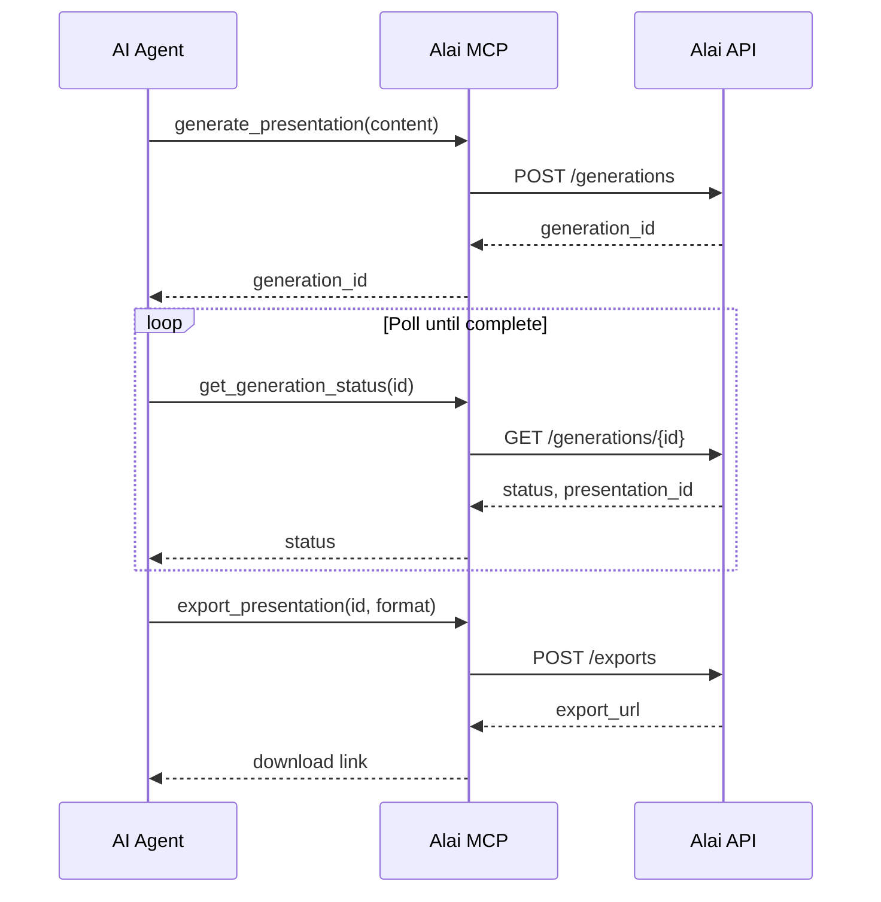

The **Alai MCP Server** allows AI agents to generate presentations, manage slides, and export content directly through the [Model Context Protocol](https://modelcontextprotocol.io/).

Use it with Claude Desktop, Claude Code, Cursor, Windsurf, Cline, VS Code, and other MCP-compatible tools.

---

## Quick Start

<Steps>
  <Step title="Get Your API Key">
    Sign up at [app.getalai.com](https://app.getalai.com) and generate an API key from your account settings.
  </Step>
  <Step title="Configure Your MCP Client">
    Add the Alai MCP server to your preferred AI tool using the configurations below.
  </Step>
  <Step title="Start Creating">
    Ask your AI agent to generate presentations, add slides, or export to PDF/PowerPoint.
  </Step>
</Steps>

---

## Available Tools

The Alai MCP server exposes 8 tools that map to the [Alai API](/api/introduction):

| Tool | Description |
|------|-------------|
| `ping` | Verify API key and return user ID |
| `generate_presentation` | Create a presentation from text content |
| `get_generation_status` | Poll async operation status |
| `create_slide` | Add a slide to an existing presentation |
| `delete_slide` | Remove a slide from a presentation |
| `export_presentation` | Export to PDF, PPTX, or shareable link |
| `generate_transcripts` | Generate speaker notes for slides |
| `delete_presentation` | Permanently delete a presentation |

---

## Client Configuration

<Tabs>
  <Tab title="Claude Desktop">
    ### Claude Desktop

    Claude Desktop supports remote MCP servers via the **Connectors** settings (Pro, Max, Team, and Enterprise plans).

    **Option 1: Via Settings UI (Recommended)**

    1. Open Claude Desktop
    2. Go to **Settings** → **Connectors**
    3. Add a new connector with the Alai MCP URL

    **Option 2: Via mcp-remote**

    Edit your `claude_desktop_config.json`:

    <Tabs>
      <Tab title="macOS">
        ```
        ~/Library/Application Support/Claude/claude_desktop_config.json
        ```
      </Tab>
      <Tab title="Windows">
        ```
        %APPDATA%\Claude\claude_desktop_config.json
        ```
      </Tab>
    </Tabs>

    Add the following configuration:

    ```json
    {
      "mcpServers": {
        "alai": {
          "command": "npx",
          "args": [
            "mcp-remote@latest",
            "https://alai-standalone-backend.getalai.com/mcp/",
            "--header",
            "Authorization: Bearer YOUR_API_KEY"
          ]
        }
      }
    }
    ```

    <Warning>
      Replace `YOUR_API_KEY` with your actual Alai API key.
    </Warning>

    Restart Claude Desktop after saving the configuration.
  </Tab>

  <Tab title="Claude Code">
    ### Claude Code (CLI)

    Add the Alai MCP server using the CLI:

    ```bash
    claude mcp add alai \
      --transport http \
      https://alai-standalone-backend.getalai.com/mcp/ \
      -H "Authorization: Bearer YOUR_API_KEY"
    ```

    Or add it via JSON configuration:

    ```bash
    claude mcp add-json alai '{
      "type": "http",
      "url": "https://alai-standalone-backend.getalai.com/mcp/",
      "headers": {
        "Authorization": "Bearer YOUR_API_KEY"
      }
    }'
    ```

    Verify the server is added:

    ```bash
    claude mcp list
    ```
  </Tab>

  <Tab title="Cursor">
    ### Cursor

    1. Open Cursor Settings (**Cmd/Ctrl + ,**)
    2. Navigate to **MCP** section
    3. Click **Add new global MCP server**
    4. Add the following configuration:

    ```json
    {
      "mcpServers": {
        "alai": {
          "command": "npx",
          "args": [
            "mcp-remote@latest",
            "https://alai-standalone-backend.getalai.com/mcp/",
            "--header",
            "Authorization: Bearer YOUR_API_KEY"
          ]
        }
      }
    }
    ```

    Alternatively, create a `.cursor/mcp.json` file in your project:

    ```json
    {
      "mcpServers": {
        "alai": {
          "command": "npx",
          "args": [
            "mcp-remote@latest",
            "https://alai-standalone-backend.getalai.com/mcp/",
            "--header",
            "Authorization: Bearer YOUR_API_KEY"
          ]
        }
      }
    }
    ```
  </Tab>

  <Tab title="Windsurf">
    ### Windsurf

    1. Go to **File** → **Preferences** → **Windsurf Settings**
    2. Select **Manage MCPs**
    3. Click **View raw config** to open `mcp_config.json`

    Add the following configuration:

    ```json
    {
      "mcpServers": {
        "alai": {
          "serverUrl": "https://alai-standalone-backend.getalai.com/mcp/",
          "headers": {
            "Authorization": "Bearer YOUR_API_KEY"
          }
        }
      }
    }
    ```

    <Tabs>
      <Tab title="macOS/Linux">
        Config location: `~/.codeium/windsurf/mcp_config.json`
      </Tab>
      <Tab title="Windows">
        Config location: `%USERPROFILE%\.codeium\windsurf\mcp_config.json`
      </Tab>
    </Tabs>
  </Tab>

  <Tab title="VS Code">
    ### VS Code (Copilot)

    <Note>
      MCP support in VS Code requires version 1.102 or later.
    </Note>

    1. Open Command Palette (**Cmd/Ctrl + Shift + P**)
    2. Run **MCP: Edit User Configuration**
    3. Add the Alai server:

    ```json
    {
      "mcp": {
        "servers": {
          "alai": {
            "command": "npx",
            "args": [
              "mcp-remote@latest",
              "https://alai-standalone-backend.getalai.com/mcp/",
              "--header",
              "Authorization: Bearer YOUR_API_KEY"
            ]
          }
        }
      }
    }
    ```

    Or create `.vscode/mcp.json` in your workspace for project-specific configuration.
  </Tab>

  <Tab title="Cline">
    ### Cline (VS Code Extension)

    1. Click the **MCP Servers** icon in the Cline extension
    2. Select the **Configure** tab
    3. Click **Advanced MCP Settings** to open `cline_mcp_settings.json`

    Add the following configuration:

    ```json
    {
      "mcpServers": {
        "alai": {
          "command": "npx",
          "args": [
            "mcp-remote@latest",
            "https://alai-standalone-backend.getalai.com/mcp/",
            "--header",
            "Authorization: Bearer YOUR_API_KEY"
          ],
          "alwaysAllow": [],
          "disabled": false
        }
      }
    }
    ```

    <Tabs>
      <Tab title="macOS">
        Config location: `~/Library/Application Support/Code/User/globalStorage/saoudrizwan.claude-dev/settings/cline_mcp_settings.json`
      </Tab>
      <Tab title="Windows">
        Config location: `%APPDATA%\Code\User\globalStorage\saoudrizwan.claude-dev\settings\cline_mcp_settings.json`
      </Tab>
    </Tabs>
  </Tab>

  <Tab title="Zed">
    ### Zed Editor

    Add the configuration to your `settings.json`:

    ```json
    {
      "context_servers": {
        "alai": {
          "command": {
            "path": "npx",
            "args": [
              "mcp-remote@latest",
              "https://alai-standalone-backend.getalai.com/mcp/",
              "--header",
              "Authorization: Bearer YOUR_API_KEY"
            ]
          }
        }
      }
    }
    ```

    Check the Agent Panel settings to verify the server is active (green indicator).

    <Note>
      Zed currently requires `mcp-remote` for HTTP-based MCP servers. Native streamable HTTP support may be added in future versions.
    </Note>
  </Tab>

  <Tab title="JetBrains">
    ### JetBrains IDEs (AI Assistant)

    JetBrains AI Assistant supports MCP servers in IntelliJ IDEA, PyCharm, WebStorm, and other JetBrains IDEs.

    1. Go to **Settings** → **Tools** → **AI Assistant** → **Model Context Protocol**
    2. Click **Add** to configure a new server
    3. Use the following configuration:

    ```json
    {
      "alai": {
        "command": "npx",
        "args": [
          "mcp-remote@latest",
          "https://alai-standalone-backend.getalai.com/mcp/",
          "--header",
          "Authorization: Bearer YOUR_API_KEY"
        ]
      }
    }
    ```

    Refer to the [JetBrains MCP documentation](https://www.jetbrains.com/help/ai-assistant/mcp.html) for detailed instructions.
  </Tab>
</Tabs>

---

## Example Usage

Once configured, you can ask your AI agent to create presentations:

<AccordionGroup>
  <Accordion title="Generate a presentation">
    **Prompt**: "Create a 5-slide presentation about the benefits of remote work"

    The AI will call `generate_presentation` and poll `get_generation_status` until complete, then provide you with the link to your presentation.
  </Accordion>
  <Accordion title="Add a slide to an existing presentation">
    **Prompt**: "Add a slide about team collaboration tools to my presentation"

    The AI will use `create_slide` with your presentation ID and the new content.
  </Accordion>
  <Accordion title="Export to PowerPoint">
    **Prompt**: "Export my presentation as a PowerPoint file"

    The AI will call `export_presentation` with format `pptx` and provide the download link.
  </Accordion>
  <Accordion title="Generate speaker notes">
    **Prompt**: "Create speaker notes for all slides in my presentation"

    The AI will use `generate_transcripts` to create detailed speaker notes for each slide.
  </Accordion>
</AccordionGroup>

---

## Workflow

Presentation generation is asynchronous. Here's how it works:



<Tip>
  Most AI agents will handle the polling automatically. You just need to describe what you want, and the agent will manage the async workflow.
</Tip>

---

## Troubleshooting

<AccordionGroup>
  <Accordion title="Server not connecting">
    - Verify your API key is correct
    - Ensure you have `npx` installed (comes with Node.js)
    - Check that your firewall allows outbound HTTPS connections
    - Restart your MCP client after configuration changes
  </Accordion>
  <Accordion title="Authentication errors">
    - API keys should start with `sk_`
    - Ensure the `Authorization` header format is `Bearer YOUR_API_KEY`
    - Generate a new API key from [app.getalai.com](https://app.getalai.com) if needed
  </Accordion>
  <Accordion title="Tools not appearing">
    - Some clients require a restart after adding MCP servers
    - Check your client's MCP settings to ensure the server is enabled
    - Verify the server status indicator (should be green/active)
  </Accordion>
  <Accordion title="Rate limits">
    - Maximum 5 concurrent generations per user
    - If you hit rate limits, wait a few seconds before retrying
    - Contact [founders@getalai.com](mailto:founders@getalai.com) for higher limits
  </Accordion>
</AccordionGroup>

---

## Security

<Warning>
  Never share your API key or commit it to version control. Use environment variables when possible.
</Warning>

For environment variable configuration, you can reference variables in your MCP config:

```json
{
  "mcpServers": {
    "alai": {
      "command": "npx",
      "args": [
        "mcp-remote@latest",
        "https://alai-standalone-backend.getalai.com/mcp/",
        "--header",
        "Authorization: Bearer ${ALAI_API_KEY}"
      ],
      "env": {
        "ALAI_API_KEY": "your_api_key_here"
      }
    }
  }
}
```

Or set the environment variable in your shell:

```bash
export ALAI_API_KEY="sk_your_api_key"
```

---

## Next Steps

<CardGroup cols={2}>
  <Card title="API Reference" icon="code" href="/api/introduction">
    Full API documentation with all endpoints and parameters
  </Card>
  <Card title="Examples" icon="lightbulb" href="/api/examples">
    Python examples and use cases for the Alai API
  </Card>
</CardGroup>
