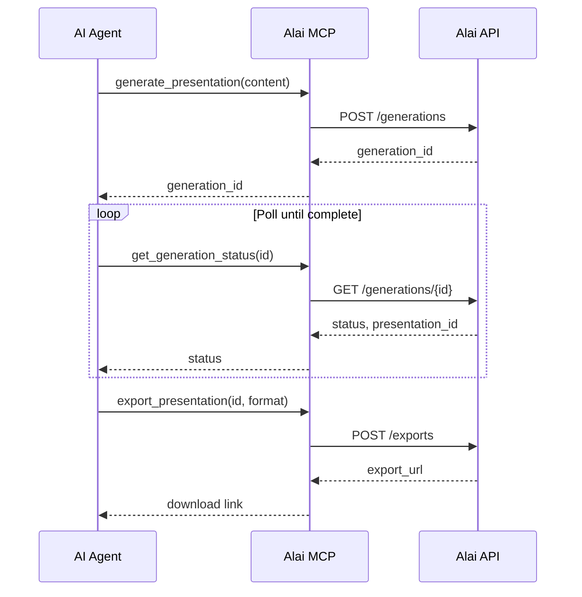

The **Alai MCP Server** lets AI agents generate presentations, manage slides, and export content directly through the [Model Context Protocol](https://modelcontextprotocol.io/).

Authentication is handled via OAuth — your editor opens a browser window for sign-in on first use. No API key required.

**MCP URL:** `https://alai-standalone-backend.getalai.com/mcp/`

---

## Getting Started

<Tabs>
  <Tab title="Claude Code">
    Run this command in your terminal:

    ```bash
    claude mcp add --transport http alai https://alai-standalone-backend.getalai.com/mcp/
    ```

    Then type `/mcp` in a Claude Code session to initiate the OAuth sign-in flow.
  </Tab>

  <Tab title="Claude Desktop">
    Go to **Settings** → **Connectors** and add a custom connector with this URL:

    ```
    https://alai-standalone-backend.getalai.com/mcp/
    ```

    Click the **+** button in the chat box, then **Connectors** to verify.

    <Note>
      Remote MCP connectors are available on Claude Pro, Max, Team, and Enterprise plans.
    </Note>
  </Tab>

  <Tab title="Cursor">
    Open **Cursor Settings** → **MCP** and add a new server, or add to `~/.cursor/mcp.json`:

    ```json
    {
      "mcpServers": {
        "alai": {
          "type": "streamable-http",
          "url": "https://alai-standalone-backend.getalai.com/mcp/"
        }
      }
    }
    ```
  </Tab>

  <Tab title="VS Code">
    <Note>
      Requires VS Code 1.102 or later.
    </Note>

    Open the Command Palette (**Cmd/Ctrl + Shift + P**), run **MCP: Add Server**, and select **HTTP**. Use this URL:

    ```
    https://alai-standalone-backend.getalai.com/mcp/
    ```

    Or add it to `.vscode/mcp.json`:

    ```json
    {
      "servers": {
        "alai": {
          "type": "http",
          "url": "https://alai-standalone-backend.getalai.com/mcp/"
        }
      }
    }
    ```
  </Tab>

  <Tab title="Windsurf">
    Go to **Windsurf Settings** → **Manage MCPs** → **View raw config** and add:

    ```json
    {
      "mcpServers": {
        "alai": {
          "serverUrl": "https://alai-standalone-backend.getalai.com/mcp/"
        }
      }
    }
    ```
  </Tab>

  <Tab title="ChatGPT">
    Go to **Settings** → **Connectors** → **Add connector** and enter:

    ```
    https://alai-standalone-backend.getalai.com/mcp/
    ```

    ChatGPT will open a browser window for OAuth sign-in.

    <Note>
      Custom connectors are available on ChatGPT Pro, Business, and Enterprise plans.
    </Note>
  </Tab>
</Tabs>

---

## Available Tools

The Alai MCP server exposes 11 tools that map to the [Alai API](/api/introduction):

| Tool | Description |
|------|-------------|
| `ping` | Verify authentication and return user ID |
| `get_presentations` | List all presentations for the authenticated user |
| `get_themes` | List theme IDs and names available to the authenticated user |
| `get_vibes` | List vibe IDs, names, and source (system or custom) for visual style presets |
| `generate_presentation` | Create a presentation from text content |
| `get_generation_status` | Poll async operation status |
| `create_slide` | Add a slide to an existing presentation |
| `delete_slide` | Remove a slide from a presentation |
| `export_presentation` | Export to PDF, PPTX, or shareable link |
| `generate_transcripts` | Generate speaker notes for slides |
| `delete_presentation` | Permanently delete a presentation |

---

## Example Usage

Once connected, ask your AI agent to create presentations:

<AccordionGroup>
  <Accordion title="List available themes">
    **Prompt**: "Show me the theme IDs I can use for a presentation"

    The AI will call `get_themes` and return the available theme IDs and display names.
  </Accordion>
  <Accordion title="Generate a presentation">
    **Prompt**: "Create a 5-slide presentation about the benefits of remote work"

    The AI can call `get_themes` first to pick a theme, then `generate_presentation` and poll `get_generation_status` until complete.
  </Accordion>
  <Accordion title="Add a slide to an existing presentation">
    **Prompt**: "Add a slide about team collaboration tools to my presentation"
  </Accordion>
  <Accordion title="Export to PowerPoint">
    **Prompt**: "Export my presentation as a PowerPoint file"
  </Accordion>
  <Accordion title="Generate speaker notes">
    **Prompt**: "Create speaker notes for all slides in my presentation"
  </Accordion>
</AccordionGroup>

---

## Authentication

Authentication is handled via OAuth 2.1. On first connection, your editor opens a browser window where you sign in to Alai. Tokens refresh automatically.

MCP clients discover OAuth configuration via:

```
GET https://alai-standalone-backend.getalai.com/.well-known/oauth-protected-resource/mcp
```

For programmatic access (CI, scripts, direct HTTP), use the [Alai REST API](/api/introduction) with an API key instead.

---

## Workflow

Presentation generation is asynchronous:


```mermaid
sequenceDiagram
    participant Agent as AI Agent
    participant MCP as Alai MCP
    participant API as Alai API

    Agent->>MCP: generate_presentation(content)
    MCP->>API: POST /generations
    API-->>MCP: generation_id
    MCP-->>Agent: generation_id

    loop Poll until complete
        Agent->>MCP: get_generation_status(id)
        MCP->>API: GET /generations/{id}
        API-->>MCP: status, presentation_id
        MCP-->>Agent: status
    end

    Agent->>MCP: export_presentation(id, format)
    MCP->>API: POST /exports
    API-->>MCP: export_url
    MCP-->>Agent: download link
```

<Tip>
  Most AI agents handle polling automatically. Just describe what you want and the agent will manage the async workflow.
</Tip>

---

## Troubleshooting

<AccordionGroup>
  <Accordion title="OAuth sign-in window doesn't open">
    - Make sure your client supports remote MCP servers with OAuth (Claude Code, Claude Desktop, Cursor, VS Code 1.102+, ChatGPT)
    - Check that your firewall allows outbound HTTPS connections
    - Restart your MCP client after adding the server
  </Accordion>
  <Accordion title="Authentication errors">
    - Re-run the OAuth sign-in flow from your client's MCP settings
    - Make sure you're signed in to the same Alai account your presentations belong to
  </Accordion>
  <Accordion title="Tools not appearing">
    - Some clients require a restart after adding MCP servers
    - Verify the server status indicator (should be green/active)
  </Accordion>
  <Accordion title="Rate limits">
    - Maximum 5 concurrent generations per user
    - Contact [founders@getalai.com](mailto:founders@getalai.com) for higher limits
  </Accordion>
</AccordionGroup>

---

## Next Steps

<CardGroup cols={2}>
  <Card title="API Reference" icon="code" href="/api/introduction">
    Full API documentation with all endpoints and parameters
  </Card>
  <Card title="Examples" icon="lightbulb" href="/api/examples">
    Python examples and use cases for the Alai API
  </Card>
</CardGroup>
