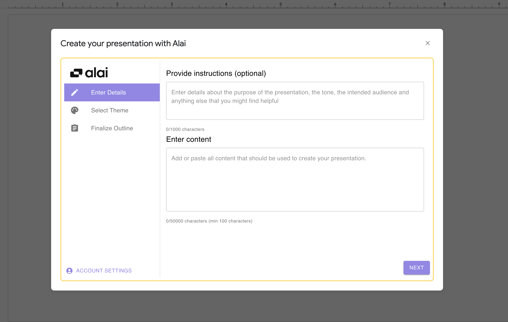
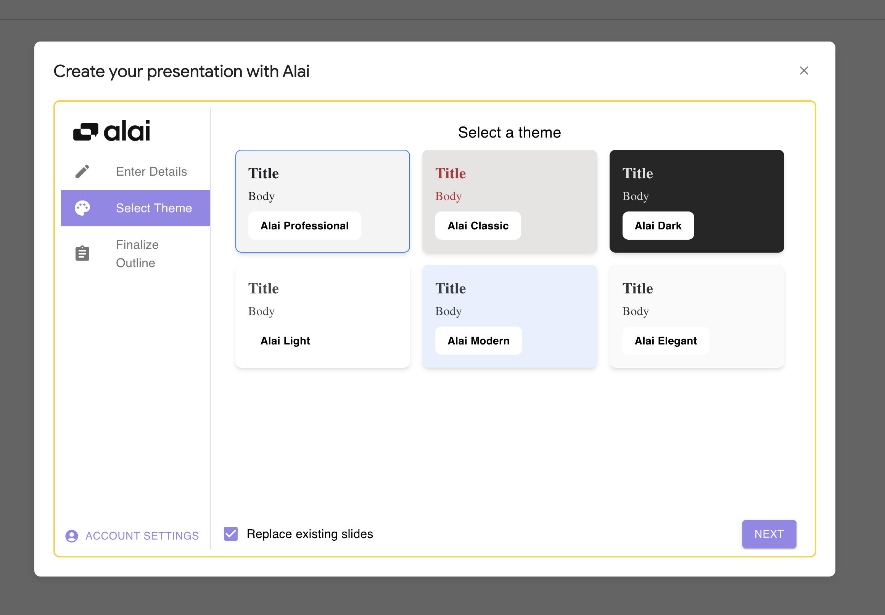
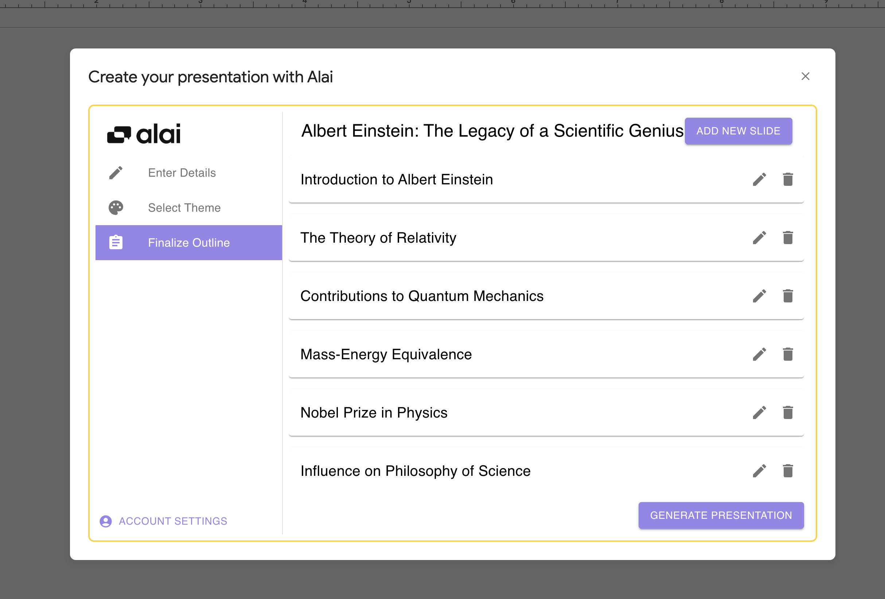

### Input Presentation Details

Kick off your slide creation by providing an overview of your presentation's purpose,
audience, and any specific instructions that will guide the content creation.

Remember, at this stage, Alai only supports only text inputs.

### Choose a Theme

Pick a theme that aligns with the tone and style of your presentation from a selection of professionally designed themes.

### Review and Customize Slides

Review the automatically generated slide titles and their order. Here, you can also add additional slides and provide specific descriptions for them.

