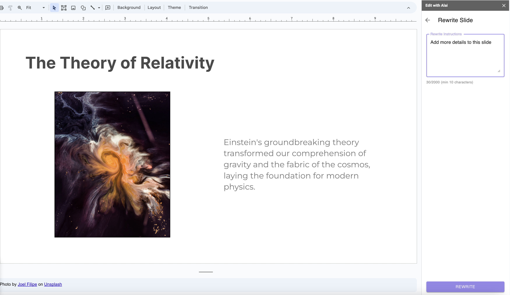
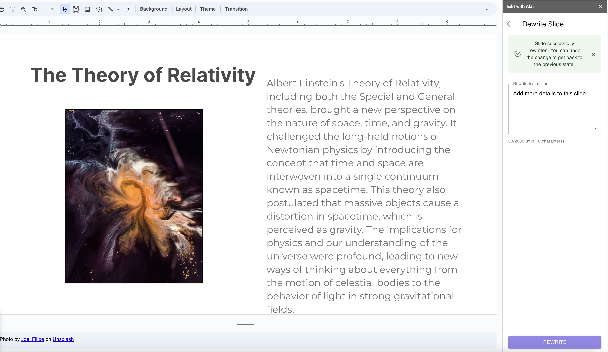
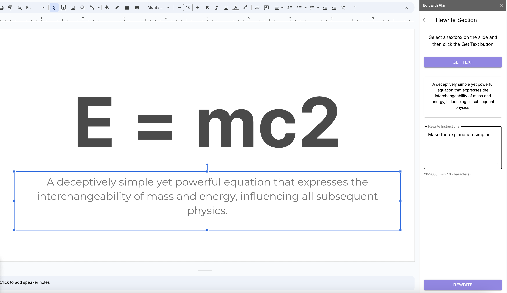
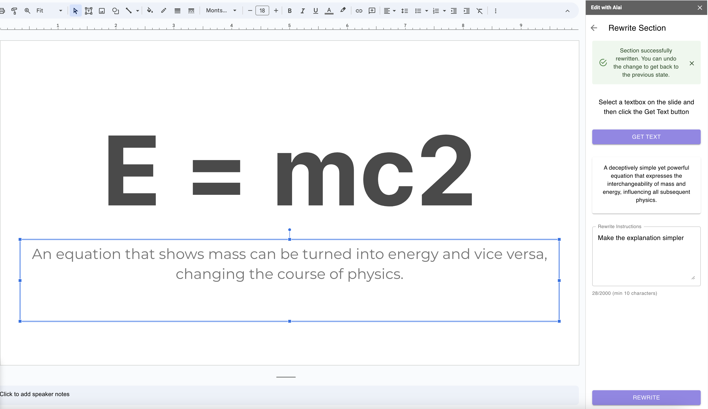

### Rewrite slide

Alai enables you to effortlessly modify the content of your slides for improved clarity and impact. To revise a slide:

1. Click on the 'Edit with Alai' sidebar.
2. In the 'Rewrite Slide' section, input specific instructions such as "simplify the text for a younger audience",
"summarize the key points" or "make the language more formal."
3. Click 'REWRITE' to see the updated version.

Before and after examples:

For optimal results, clearly specify what aspects of the slide you want to enhance or elaborate on.

### Rewrite section

Rewrite a specific part of your slide without modifying any other text.

1. Click on the text box you wish to edit to highlight it.
2. Open the 'Edit with Alai' panel, select 'REWRITE SECTION', then select 'GET TEXT' to work with the current text.
3. In the 'Rewrite Section', type in your instruction, like "Make the explanation simpler."
4. Press 'REWRITE' to update the slide.

Before and after examples:

