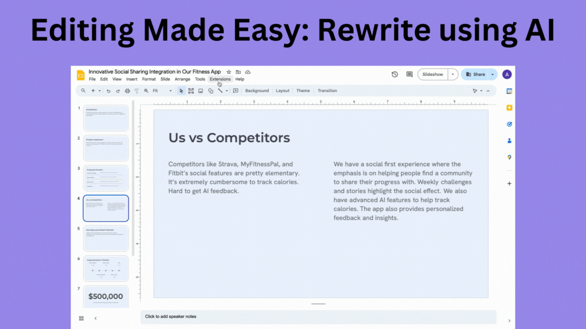

<CardGroup cols={3}>
  <Card
    title="Rewrite slide"
    icon="pen-to-square"
    href="../edit/rewrite-slide"
  >
    Rewrite the entire slide
  </Card>
  <Card
    title="Rewrite section"
    icon="pen-nib"
    href="../edit/rewrite-section"
  >
    Rewrite a specific part of the slide
  </Card>
  <Card
    title="Change layout"
    icon="table-layout"
    href="../edit/change-layout"
  >
    Change layout of your current slide
  </Card>
  <Card
    title="Insert slide"
    icon="arrows-down-to-line"
    href="../edit/insert-slide"
  >
    Add a new slide
  </Card>
  <Card
    title="Change theme"
    icon="paintbrush"
    href="../edit/change-theme"
  >
    Change the theme of your presentation
  </Card>
</CardGroup>