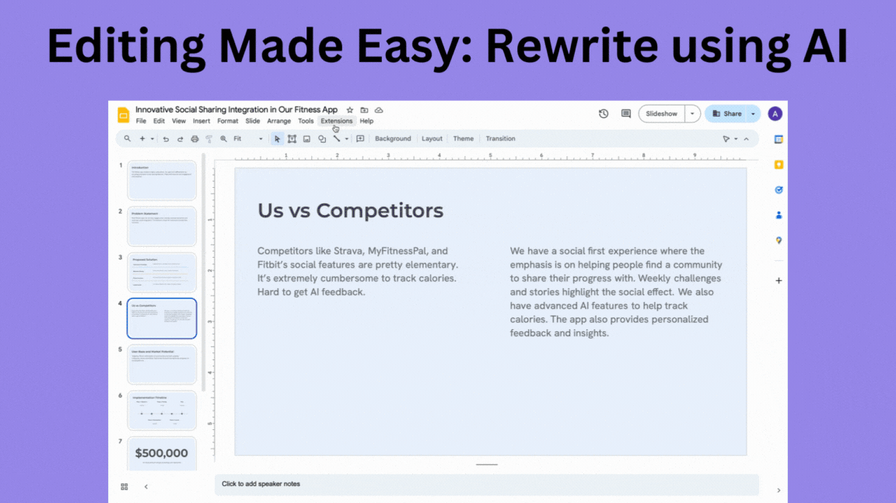

Alai enables you to effortlessly modify the content of your slides for improved clarity and impact.

<Steps>
  <Step title="Access 'Edit with Alai' Sidebar">
    Click on the 'Edit with Alai' sidebar to start the rewriting process for your slide's content.
  </Step>
  <Step title="Input Rewrite Instructions">
    In the 'Rewrite Slide' section, enter specific instructions for how you want to modify the slide's text. For example, "simplify the text for a younger audience", "summarize the key points", or "make the language more formal."
  </Step>
  <Step title="Execute Rewrite">
    Click the 'Rewrite' button to apply the changes and see the updated version of your slide.
  </Step>
  <Step title="Review and Refine">
    For optimal results, review the rewritten content and make any further adjustments to ensure it meets your specific needs or preferences.
  </Step>
</Steps>

<Note>For optimal results, clearly specify what aspects of the slide you want to enhance or elaborate on.</Note>