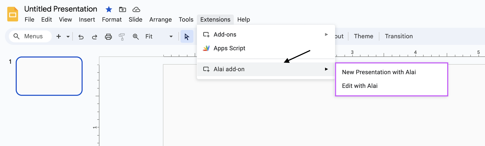
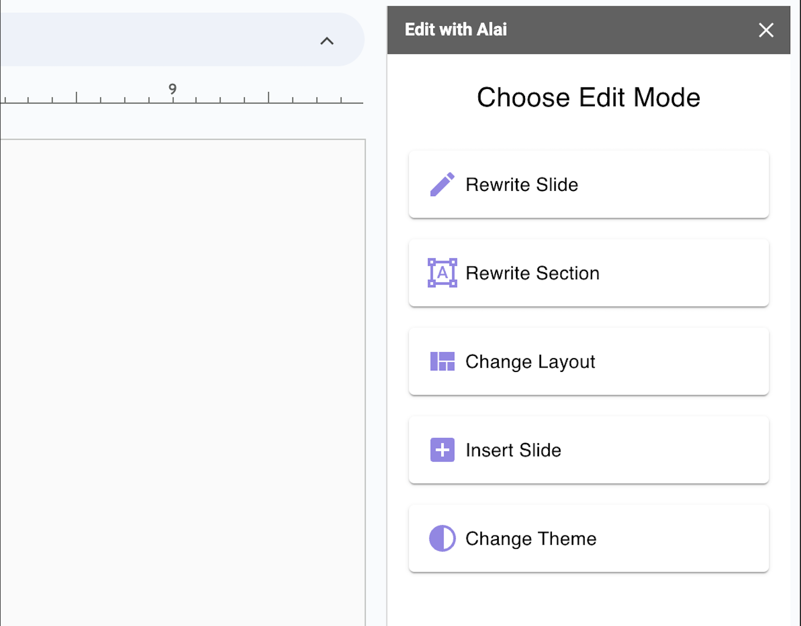

<Steps>
  <Step title="Get the Alai Add-On">
    To begin using Alai, first install the add-on from the Google Workspace Marketplace.

    Install here: [Coming Soon](#)

  </Step>
  <Step title="Access Google Slides">
    Navigate to Google Slides to either start a fresh presentation or continue working on an existing one.

    Quick access to create a new presentation: [https://slides.new/](https://slides.new/)

  </Step>
  <Step title="Launch">
    From within Google Slides, launch Alai by selecting it from the 'Extensions' menu. Follow the prompts to get Alai up and running.

    

  </Step>
  <Step title="Create with Alai">
    Begin creating your presentation with Alai. Input content and watch as Alai transforms it into slides.

    Learn more here:
    <CardGroup cols={1}>
      <Card
        title="Create new presentation"
        icon="pen-to-square"
        href="create-new"
      >
        Generate a new presentation using just your context
      </Card>
    </CardGroup>

    

  </Step>
  <Step title="Edit with Alai">
   You’re now ready to edit your presentations with Alai. Dive in and explore the creative possibilities.

    Learn more here:
    <CardGroup cols={1}>
      <Card
        title="Edit your presentation"
        icon="pen-to-square"
        href="../edit/overview"
      >
        Rewrite, change layouts and more!
      </Card>
    </CardGroup>

    

  </Step>
</Steps>
